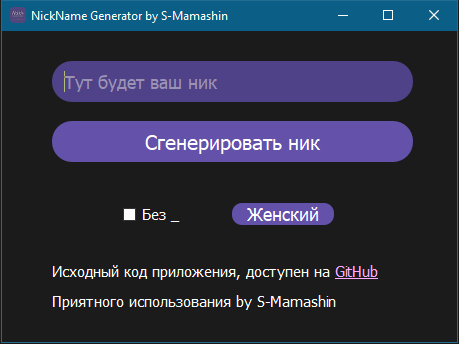

# NickGenerator

And another one of my useless projects for generating names and nicknames :D

This application allows the user to generate a name or nickname!

## **About**
I used Python in duo with Qt5 to create the interface! 🐍

---
## **Preview**

---
## **How to run it?**
You can use this after installing PyQt5 module
* pip install pyqt5
  
Or build it with pyinstaller

* pyinstaller -F ng.py

---
## **Author**
Stepan Mamashi
